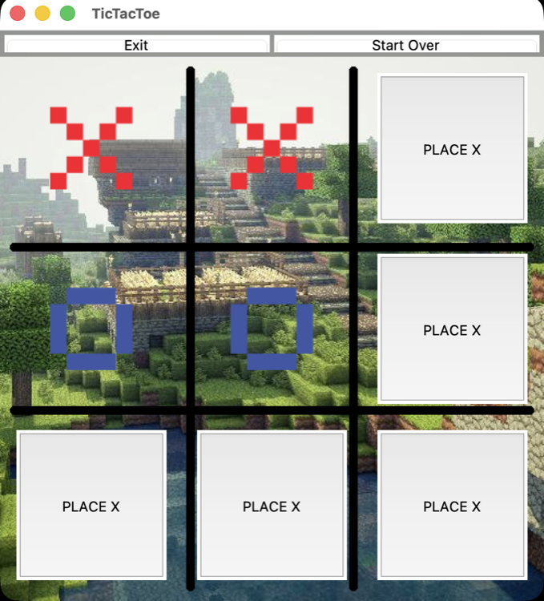
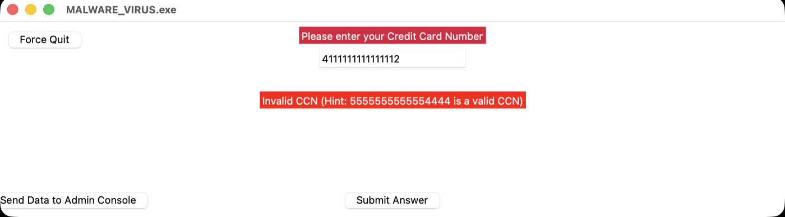

> [!WARNING]
> **This is my Grade 10 Exploring Computer Science coursework from 2021-2022.** It's a year of Python exercises, class notes and two graded assessments, and I stopped touching it in July 2022 when the class ended. The final assessment runs and looks the way it did when I handed it in. Several of the smaller programs are broken: one login window has a button wired to nothing, and the terminal login accepts duplicate usernames and passwords without symbols. I've documented all of it in [Known issues](#known-issues) instead of fixing it, because the point of keeping this around is the record of what I could write at fifteen.

<div align="center">


</div>

## About

This is where I learned Python. It starts at `print('Hello World')` and ends with two tkinter apps I built for grades, and the repo keeps both ends of that plus everything in between. The folders follow the order the class taught them: basics first, then classes, then GUI work, then the assessments that put the two together.

The final assessment is the piece worth opening. It's a fake iPhone home screen with two apps behind the icons: a TicTacToe game with image tiles and win detection, and a phishing parody that asks for your mother's maiden name and a credit card number, runs the card through the Luhn algorithm, then tells you not to call your bank.

Everything runs on the standard library. There's no `requirements.txt`, no build step and nothing to install.

- Fake iPhone home screen sized to 414x896, which is an iPhone 11 Pro Max divided by three, with app icons drawn on a Canvas at fixed coordinates
- TicTacToe with PNG tiles, eight win patterns checked after every move, three victory screens and a restart button
- A phishing parody that collects four security answers and a card number, validates the card with Luhn, and appends each run to a text file
- A 431-line terminal login system with sign-up, password hints, an admin panel that can edit and delete accounts, and a word-guessing minigame behind the login wall
- A twelve-second ASCII art boot sequence that spells out ADVANCED LOGIN SYSTEMS one word at a time before the first menu appears
- A `User` class with getters and setters, and two separate login systems built on top of it, one console and one tkinter
- Roughly twenty single-concept exercise scripts: lists, dictionaries, functions, conditionals, a guessing game, a calculator I never wired up past the `+` branch

## Tech stack

| Layer | Technology | Why it's here |
|---|---|---|
| Language | Python 3.10 | What the class taught. The PyCharm project SDK pins 3.10, and nothing in here uses syntax newer than f-strings. I ran it all on 3.13 without a change |
| GUI | tkinter with Tk 8.6 or newer | The only GUI toolkit in the standard library, so the class used it. Canvas widgets do the layout in both assessments, and Tk 8.6 is the floor because of PNG |
| Storage | Plain text files | `accounts.txt` holds users and `user_data.txt` holds the parody's harvest. Neither is a database and neither is encrypted |
| Serialization | `json` and `ast` | Both standard library. The code mixes them, writing with `json.dump` and reading back with `ast.literal_eval`, which is one of the known issues |
| Tooling | None | No bundler, package manager or test runner. The `.idea/` folder is committed, which is why the PyCharm SDK name survives in the repo |

## Screenshots

All captured on Python 3.13, driving the real windows through their own buttons.


The home screen. Opening an app destroys this window rather than hiding it, so coming back out of a game rebuilds the menu from nothing.



TicTacToe with four moves played. The five empty squares are still buttons, and they relabel themselves between PLACE X and PLACE O as the turn changes.


One move later X takes the top-right square and finishes the row. The win swaps the whole board for a victory image and destroys all nine tile buttons, which is why only Exit and Start Over are left. I drew the trophy myself.



The last question runs the number through Luhn and refuses it here, so the prompt stays put. A number that passes clears the form and appends the answers to `assets/user_data.txt`. The button in the bottom-left corner is cut off by the window edge in the app itself, not by how I cropped this.

## Getting started

### Prerequisites

- Python 3.10 or newer. The PyCharm SDK says 3.10 and nothing needs more than that. I last ran everything on 3.13
- Tk 8.6 or newer, which is the part that bites. Every image in this repo is a PNG, and `PhotoImage` couldn't read PNG until Tk 8.6. macOS ships `/usr/bin/python3` with Tk 8.5, so on a stock Mac every graphical program here dies with `_tkinter.TclError: couldn't recognize data in image file "assets/background.png"`. Check with `python3 -c "import tkinter; print(tkinter.TkVersion)"`, and if it prints 8.5, install a newer one with `brew install python-tk@3.13` and use `python3.13`
- Nothing else. Every import in the repo is standard library, so there's no `requirements.txt` and no `pip install` step

### Installation

There's no install step. Clone it:

```bash
git clone https://github.com/saturncity/misc-explore-cs-notes.git
cd misc-explore-cs-notes
```

### Configuration

None. Nothing here reads an environment variable, opens a socket or talks to an API. The two text files it reads sit next to the code.

### Running

Most of these find their data by paths relative to the working directory, so `cd` into the folder first or they won't locate their assets.

The final assessment, which is the one worth looking at:

```bash
cd "S2A2 Assessment"
python3 MainWindow.py
```

The terminal login system, with the ASCII boot sequence. Sign in as `admin` / `1234`, which has the admin flag, so option 2 from the logged-in menu opens user management:

```bash
cd "Login System"
python3 login.py
```

The console version of the OOP login. Sign in as `admin` / `guess_me`:

```bash
cd OOP
python3 Login_System.py
```

The two-window tkinter login that hands off to a temperature converter. It does `from OOP.User_Model import User`, so the repo root has to be importable:

```bash
PYTHONPATH=. python3 "OOP/GUI_Intro/TwoWindows.py"
```

The standalone widgets run from anywhere:

```bash
python3 "OOP/GUI_Intro/window.py"          # four-function calculator
python3 "OOP/GUI_Intro/unitconverter.py"   # Fahrenheit and Celsius
```

The Python Basics scripts are one-file exercises. Run them individually from inside that folder:

```bash
cd "Python Basics"
python3 Guessing_Game.py
```

None of these is a server, so there's no port and no URL to open.

## Project structure

```text
.
├── Login System/
│   ├── login.py            # 431 lines: sign-up, hints, admin panel, word game, ASCII intro
│   ├── accounts.txt        # JSON account list, seeded with admin/1234
│   └── Entertainment.py    # a one-window joke I wrote in about a minute
├── OOP/
│   ├── User_Model.py       # the User class both login systems are built on
│   ├── Login_System.py     # console login using User_Model, run from this folder
│   ├── OOP_Intro.py        # first day of classes: Restaurant, Dog, User
│   ├── accounts.txt        # comma-separated accounts, a different format to the one above
│   └── GUI_Intro/          # tkinter scratch work: calculator, converter, two login windows
├── Python Basics/          # first-semester exercises, one concept per file
├── S2A2 Assessment/
│   ├── MainWindow.py       # the fake phone home screen, entry point for the assessment
│   ├── TicTacToe.py        # image-tile game with win detection and a restart button
│   ├── Snake.py            # phishing parody, Luhn-validates the card number
│   └── assets/             # PNGs, plus user_data.txt where the parody writes its answers
├── docs/
│   ├── assets/             # the screenshots above
│   └── README.old.md       # the original 2022 README
├── LICENSE
└── README.md
```

## Known issues

Things I know are wrong with it. I found each by reading the code and confirmed each against a real run. I'm leaving all of them, because patching this now would turn it into something I didn't write in 2022.

- **The login button in `OOP/GUI_Intro/LoginWindow.py` does nothing.** Line 29 builds it as `Button(text="Login")` with no `command=`. Reading the widget back gives an empty command string, so `login_handle`, `search_user` and `authentication` in that file are all unreachable. `TwoWindows.py` is the working version of the same idea.
- **That same file reads the wrong accounts format.** It loads `Login System/accounts.txt`, which is JSON, using a parser that splits on commas. It doesn't crash. It builds a user whose username is the literal string `[{"username": "admin"`. The comma-separated file it wants is `OOP/accounts.txt`.
- **The duplicate username check in `login.py` is broken.** The loop over existing users never breaks, so whichever user it examines last decides the outcome. With `admin` and `bob` on file, registering a second `admin` goes through, because `bob` didn't match. Adding a `break` would fix it.
- **The password rules in `login.py` don't enforce symbols.** The check reads `any(ele not in "[@_!#$%^&*()<>?/|}{~:]" for ele in password)`, which asks whether any character is *not* a symbol. Every ordinary password satisfies that, so `Abc123` gets accepted with no symbol in it. The `not in` should be `in`.
- **`login.py` crashes if you type a letter at the password hint prompt.** A bare `except: pass` swallows the failed `int()` conversion, then the next line reads `choice`, which was never assigned. You get `UnboundLocalError: local variable 'choice' referenced before assignment` and lose the registration.
- **`login.py` shows a password error after a successful sign-up.** The error assignment sits at the bottom of the `while` loop instead of inside the failure branch, so it fires on the way out. You see the account created, then get told your password was too weak.
- **The admin menu's invalid-option message never appears.** `admin_access()` declares `global admin_action, exit_admin` but not `error`, so its `error = "Invalid Option."` writes to a local that's thrown away the moment the function returns.
- **A button hangs off the left edge of the Snake window.** "Send Data to Admin Console" is placed at `x=87` with `anchor=CENTER`, but it renders 210 pixels wide, which puts its left edge at -18 and cuts off the first characters. It's visible in the screenshot above. I only caught this by looking at the capture rather than the code.
- **Two dead assets.** Nothing references `OOP/GUI_Intro/cat.png` or `S2A2 Assessment/assets/TicTacToe/tictactoe_background-alt.png`. The window titled "Cat Memez" in `TwoWindows.py` loads `python.png` instead of the cat, so the joke doesn't land.
- **Dead methods.** `write_to_file` is defined in both `LoginWindow.py` and `TwoWindows.py` and called from neither, so neither GUI ever saves an account it creates.
- **TicTacToe leaks canvas items.** Start Over draws a fresh background over the old X and O images rather than deleting them, so the item count climbs every round. You can't see it, and nobody plays enough rounds for it to matter.
- **The docstring on `Snake.validate` isn't one.** It's an f-string, and an f-string as the first statement in a function is an expression rather than a docstring, so `validate.__doc__` comes back as `None`. The Luhn implementation itself works, and it's credited to the Stack Overflow answer quoted in that file.

There are no `TODO` or `FIXME` comments anywhere in the repo.

## Contributing

I'm not taking contributions on this one, and I'm not fixing anything in the list above. It's finished coursework and the value in keeping it is that it's unchanged. Fork it if something here is useful to you.

## License

MIT. See [`LICENSE`](LICENSE) for the full text.
